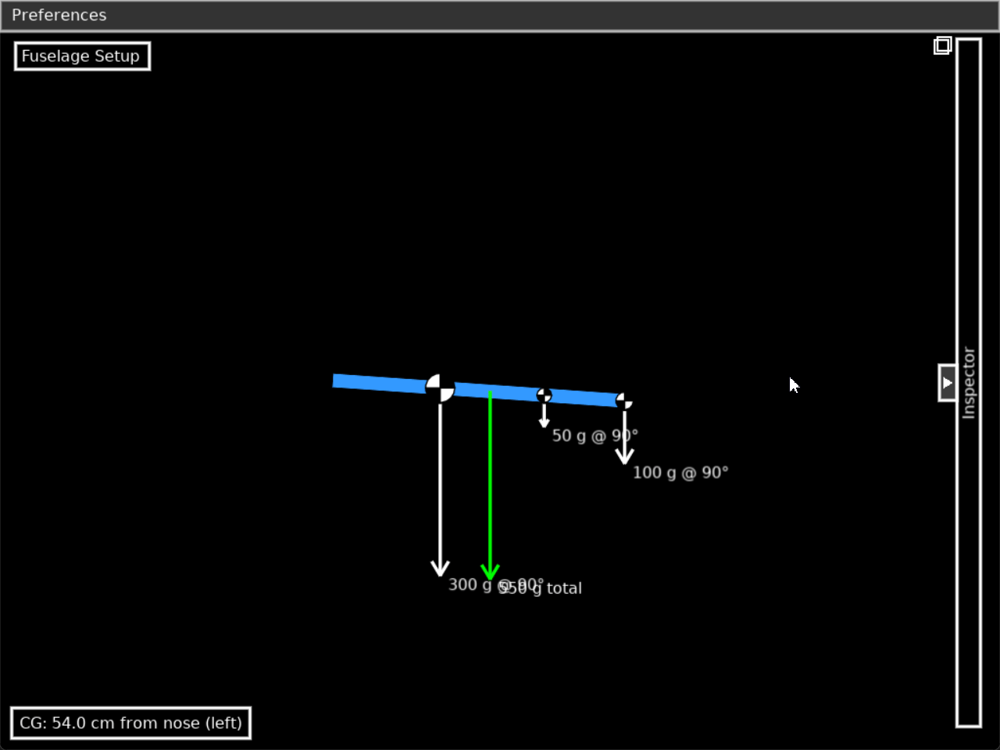
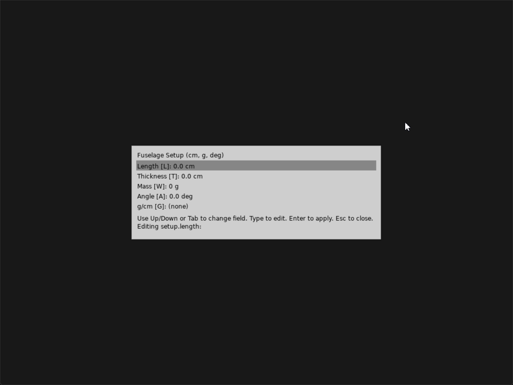
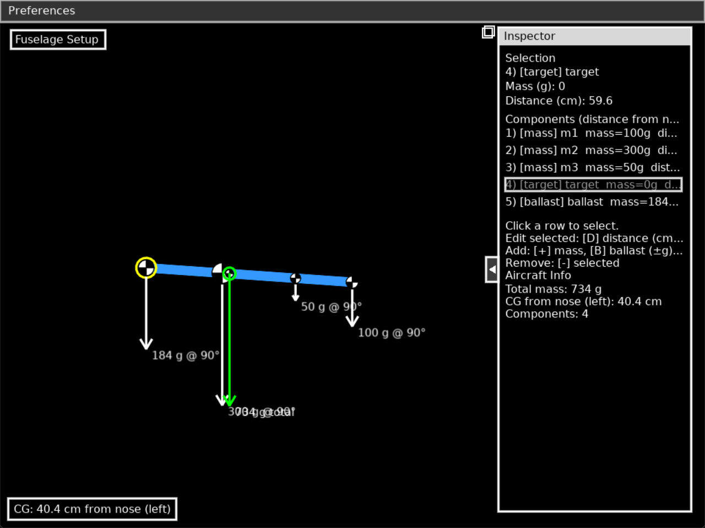

# Glidex

Visual mass-properties and longitudinal balance tool for aircraft and unmanned aerial vehicles (UAV). Plan and validate center of gravity (CG) along the fuselage, explore what‑if mass changes, and support longitudinal stability targeting for optimal performance.


## Quick demo




## What it is

Glidex is a focused, fast, 1‑D mass distribution and CG planning tool:

- Calculate CG along the fuselage from point masses you place and edit
- See gravity vectors scaled for readability to compare configurations
- Use body geometry and attitude (length, thickness, angle) as reference context
- Plan ballast, battery, and payload placement to reach a target CG

It’s ideal for model aircraft, RC gliders, and UAVs during design, integration, and field tuning.

Note: Glidex does not include an aerodynamic solver. For full longitudinal stability (e.g., static margin), you supply your own aerodynamic references (neutral point, MAC, etc.). Glidex gives you an accurate CG to compare against those references.

## Features

- Visual side view (nose-at-right); distances increase to the left from the nose
- Point masses with CG-style icons; drag horizontally on the canvas
- Adaptive gravity vectors so sizes stay comparable across configurations
- Fuselage Setup modal: length, thickness, mass or g/cm, angle (deg)
- Settings dialog: resolution list, fullscreen toggle, UI scale, panel width, font size
- Inspector panel with list, per‑row editing, and totals (mass, CG)
- Bottom‑left CG HUD showing computed CG from the nose

## Methodology (how CG is computed)

- Coordinate convention: nose at right; distance increases to the left from the nose
- Units: distance in centimeters (cm), mass in grams (g), angle in degrees (deg)
- CG formula (1‑D along fuselage):
	- CG_from_nose = Σ(m_i × d_i) / Σ(m_i)
	- where d_i is each component’s distance from the nose (cm)
- Vectors: gravity vectors are drawn with an adaptive scale so the largest visible vector remains readable without overwhelming smaller ones

Using Glidex with stability targets:
- If you know your wing’s MAC and neutral point (NP) from airfoil/planform analysis, derive static margin using the CG Glidex reports
- Example (informal): Static Margin ≈ (NP − CG) / MAC (positive means CG ahead of NP)
- Glidex helps you position masses to move the CG to the desired target; it does not compute NP or MAC

## Controls

- Select a component from the right panel or by clicking its icon on the canvas
- Edit selected: D = distance (cm), M = mass (g); type numbers, Enter to apply
- Manage: + = add mass, - = remove selected, B = add ballast, G = add CG target
- Fuselage Setup: L/T/W/A/G keys to focus fields; Tab/Up/Down to cycle; Esc to close
- Preferences menu at the top opens Settings; “Fuselage Setup” button opens the setup modal

## Install and run (Windows)

1) Install LÖVE from https://love2d.org (Windows build)
2) Run Glidex:
	- Drag the `Glidex` folder onto the LÖVE shortcut, or
	- PowerShell:

```powershell
& "C:\Program Files\LOVE\love.exe" "d:\Glidex"
```

Adjust the path to `love.exe` if you installed LÖVE elsewhere.

## Typical workflows

- New design budgeting: start from an empty fuselage, add major masses (battery, servos, avionics, payload), and iterate to reach a target CG
- Battery and payload placement: slide the heaviest components along the fuselage to see CG movement and choose a mounting bay
- Ballast planning for conditions: add/remove ballast to achieve your preferred CG for wind/thermal conditions
- UAV integration: evaluate how swapping sensors or a larger battery shifts CG before committing to hardware changes
- Field tuning: after test flights, nudge mass positions to match pilot feedback and re‑center the body for clear comparisons

## Screens



## UI tour

- Top ribbon: Preferences menu (open Settings), plus a “Fuselage Setup” button
- Fuselage Setup modal: edit body length, thickness, mass (or g/cm), and angle in deg
- Inspector (right): list of components with per‑row mass/distance editing and roll‑up totals
- Canvas: CG‑style icons you can click/drag horizontally; vectors show relative mass visually
- CG HUD: persistent readout of current CG from the nose

## Roadmap

- Save/load projects (JSON)
- Multiple fuselage profiles and named configurations
- Export snapshots (PNG) with annotations
- Optional NP/MAC annotation to visualize static margin directly

## Troubleshooting

- Images don’t show in the README: ensure you view it within the repo (relative paths), or open the files directly
- LÖVE won’t launch the folder: verify the install path of `love.exe`, or try dragging the folder onto the LÖVE shortcut
- UI text too small/large: open Settings and adjust UI scale and base font size

## License

See `LICENSE`.

---

## Technical appendix (program structure)

Architecture overview
- Language/runtime: Lua + LÖVE 2D
- Entry: `main.lua`
- Core domain: `codee/`
	- `vector.lua`, `vector_calc.lua`, `vector_draw.lua` – vector math, COM and drawing helpers
	- `maing_body.lua` – body (fuselage) representation and transforms (world/local)
	- `body_handler.lua` – list of point masses (components), add/remove/edit
	- `autobalance.lua` – auxiliary logic for balancing (if used)
- UI layer: `codee/ui.lua` (orchestrator) + `codee/ui_elemets/` (modular UI primitives)
	- `ui.lua` – draw loop, windows/panel, modals, input routing, hit-maps, settings
	- `ui_elemets/` – reusable UI helpers
		- `button.lua`, `label.lua`, `truncate.lua` – basic widgets and text utilities
		- `window.lua` – minimal window frame + scissor
		- `fillbar.lua` – selection/focus highlight
		- `colors.lua` – luminance/contrast helpers
		- `layout.lua` – row metrics and padding
		- `hit.lua` – rectangle/circle hit-detection utilities
		- `init.lua` – aggregator used via `require('codee.ui_elemets')`
		- `sections/` – extracted UI sections
			- `setup_modal.lua` – “Fuselage Setup” dialog
			- `settings_modal.lua` – Settings dialog (resolution, fullscreen, UI scale, panel width, font size)
			- `hud.lua` – bottom-left CG HUD

Render flow (per frame)
1. `UI:draw()` sets font, draws top ribbon and the left “Fuselage Setup” button
2. Clears and rebuilds `self.hit` (hit-maps) for this frame
3. Draws Inspector window (or collapsed bar), listing components and building per-row hitboxes
4. Draws modals if open (setup/settings) and the CG HUD
5. Draws selection/focus highlights as needed

Input flow
- Mouse: `UI:mousepressed/mousemoved/mousereleased`
	- Uses `self.hit` maps created during `draw()`; guards ensure tables exist before access
	- Canvas icon dragging updates the selected mass distance (clamped to body length)
- Keyboard: `UI:keypressed`
	- Modal-first handling (Setup, Settings)
	- Global shortcuts for selection and editing (D/M/+/-/B/G, arrows, Tab)

Hit-maps and safety
- `self.hit` is rebuilt each frame with sub-tables: `body`, `comp.mass`, `comp.dist`, `comp.icon`, `setup`, `settings`, `selection`
- Sections ensure their sub-tables exist before writing (defensive init)

Persistence
- User settings (panel width, font size, UI scale, fullscreen, window size, resolution index) are saved to `settings.ini`

Performance notes
- Minimal allocations per frame; hit-maps recreated as shallow tables
- Scissoring used for window content to avoid overdraw outside regions

Extending the UI
- Add new primitives in `codee/ui_elemets/` and re-export them via `init.lua`
- Add new sections under `codee/ui_elemets/sections/` and call them from `UI:draw()`
- Keep hitbox creation inside the section drawing function to localize logic

