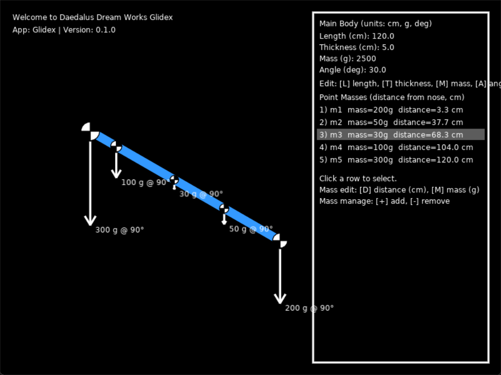

# Glidex

An intuitive visual calculator for free-flight glider model aircraft and RC. Designed for pilots and builders/modellers to fine‑tune, calculate, and iterate for efficiency and performance.

Glidex lets you place point masses along a fuselage side view, see their gravity vectors, and read/adjust the body geometry and angle in familiar units (cm/deg/g). It’s fast, visual, and keeps everything on a consistent scale so comparisons are meaningful.



## What’s included

- `main.lua` – app entry point (draw loop and wiring)
- `codee/maing_body.lua` – main rectangular body (side view) with transforms
- `codee/body_handler.lua` – point-mass manager and CG-style icon drawing
- `codee/ui.lua` – right-side UI: edit body and masses, numeric input
- `codee/config.lua` – basic app config
- `functions/` – reserved (empty)
 - `codee/vector.lua` – vector math utilities
 - `codee/vector_draw.lua` – vector arrow drawing and labels
 - `love_hUixN8SXCh.png` – preview image used in this README
 - `LICENSE` – project license
 - `README.md` – this documentation

Key features
- Visual side view with nose-at-right convention
- Point masses with CG-style icons, drag-to-move horizontally
- Per-mass gravity vectors with adaptive scaling: the largest visible vector targets ~25% of the viewport so all vectors stay comparable and readable
- Degree-based body angle control; body remains centered after edits
- Clear, consistent units: cm (distance), deg (angle), g (mass)

## Install and run (Windows)

1) Install LÖVE
- Download LÖVE for Windows from https://love2d.org
- Install it (default options are fine)

2) Run this project
- Option A: Drag the project folder `Glidex` onto the LÖVE shortcut
- Option B: Right-click the folder, choose “Open with” -> LÖVE
- Option C (PowerShell):

```powershell
& "C:\Program Files\LOVE\love.exe" "d:\Glidex"
```

If your install path differs, adjust the `love.exe` path accordingly.

## How to use

Units and frames
- Lengths are in centimeters (cm), masses in grams (g), angles in degrees (deg).
- Nose-at-right convention: the nose is the right end; distance increases to the LEFT from the nose.
- The main body is centered on screen; edits keep it centered.
 - Gravity vectors auto-scale based on the largest visible vector so everything is readable and proportional.

Body (rectangle) controls
- Press keys to select a field, type a number, press Enter to apply:
	- L: Length (cm)
	- T: Thickness (cm)
	- W: Mass (g)
	- A: Angle (deg)

Point masses (CG markers)
- List appears on the right panel. Click a row (or the icon on canvas) to select.
- Edit selected mass:
	- D: distance from nose (cm)
	- M: mass (g)
- Manage masses: `+` to add (100 g at distance=0), `-` to remove selected
- Drag the selected mass horizontally on the canvas; position clamps to [0 .. body length].
 - Gravity vector length is proportional to mass and auto-scales relative to the largest on-screen vector.

Icon style
- Each point mass is drawn as a CG-style circle split by vertical and horizontal lines:
	- Top-right and bottom-left quadrants are black
	- Top-left and bottom-right quadrants are white
- Icon size scales linearly with mass; larger masses draw larger icons.

## Notes

- No file save/load yet.
- Depth (cm) exists for completeness but isn’t shown in pure side view.
- Default scale is 1 cm = 3 px; this only affects drawing, not units.
 - Vectors: largest visible vector ≈ 25% of the shorter screen dimension (clamped 100–220 px) for readability.

